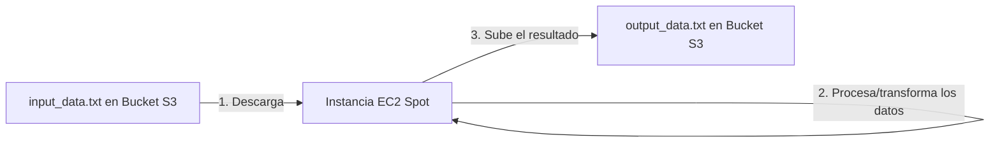
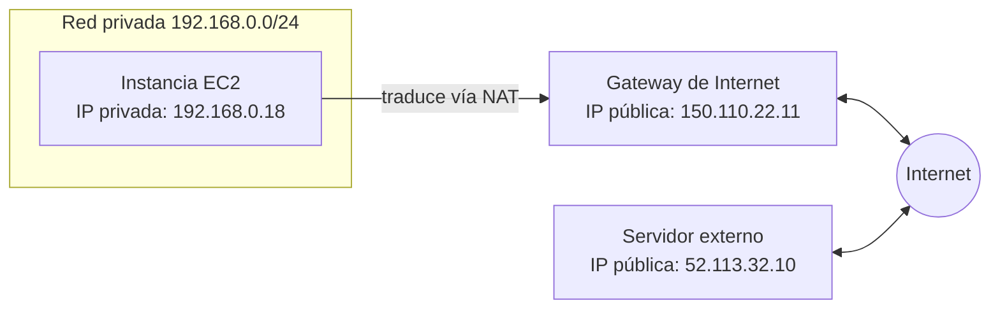
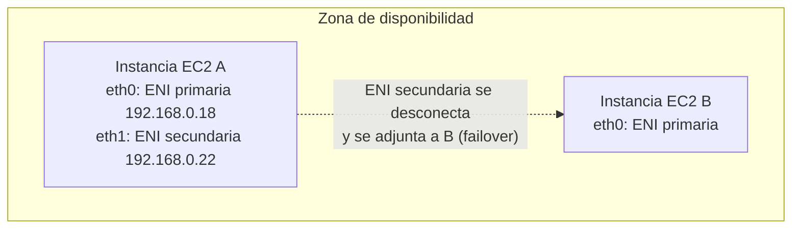
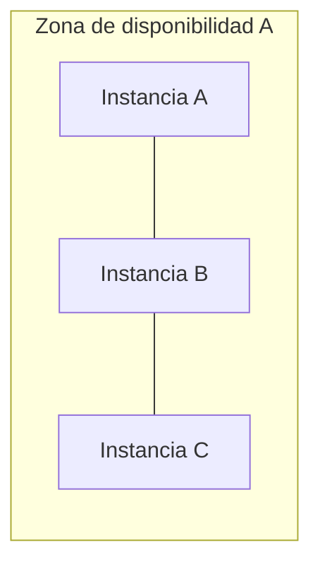
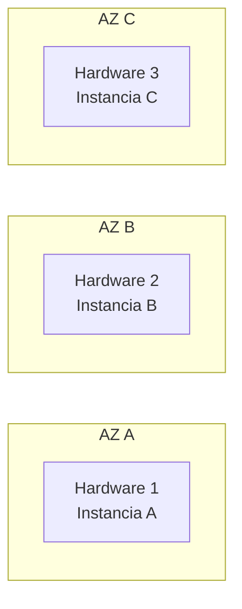
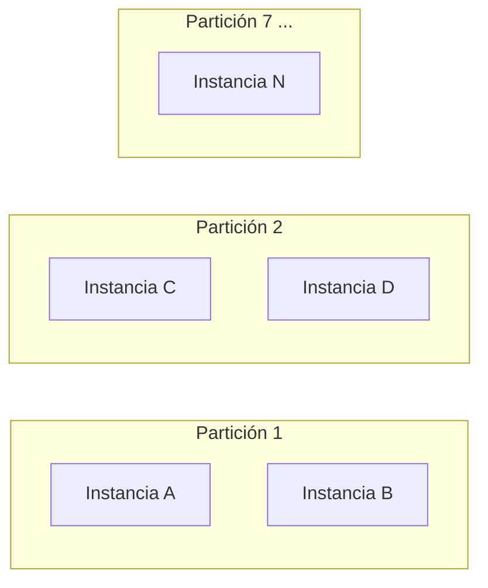
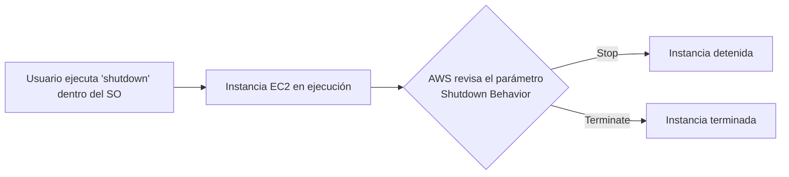

# EC2 Avanzado

## Índice

- Roles IAM para EC2
- Instancias Spot
- Spot Fleet
- Instancias de Rendimiento en Ráfaga (Burstable - T2/T3)
- Direcciones IP en EC2
- Elastic IP
- Elastic Network Interface (ENI)
- Hibernación de instancias
- EC2 para Big Data
- Procesadores AWS Graviton
- Enhanced Networking
- Placement Groups
- Comportamiento de apagado (Shutdown Behavior)
- Protección contra terminación
- Solución de problemas al lanzar instancias EC2
- Métricas de CloudWatch para EC2
- Comprobaciones de estado de EC2 (Health Checks)
- Instance Metadata Service (IMDSv2)
- Tenencia de instancias

---

# Roles IAM para EC2

## ¿Qué es un IAM Role?

Un IAM Role permite que una instancia EC2 acceda a servicios de AWS sin almacenar credenciales dentro del servidor.

La instancia obtiene credenciales temporales automáticamente mediante el rol asignado.

### Ventajas

- Mayor seguridad.
- No se almacenan Access Keys.
- Principio de mínimo privilegio.
- Rotación automática de credenciales.

### Casos de uso

- Leer o escribir en S3.
- Acceder a DynamoDB.
- Publicar logs en CloudWatch.
- Obtener secretos desde Secrets Manager.
- Desplegar aplicaciones automáticamente.

---

# Instancias Spot

## ¿Qué son?

Son instancias EC2 que utilizan capacidad libre de AWS.

Ofrecen descuentos de hasta un **90%** respecto a una instancia On-Demand.

A cambio, AWS puede recuperarlas cuando necesite esa capacidad.

---

## Funcionamiento

El usuario define un precio máximo.

Mientras el precio Spot sea inferior, la instancia continúa ejecutándose.

Si AWS necesita la capacidad:

- puede detenerla
- terminarla
- hibernarla (si está soportado)

AWS avisa aproximadamente **2 minutos antes** de interrumpirla.

---

## Spot Blocks

Permiten reservar una instancia Spot durante un periodo de **1 a 6 horas**.

Aunque es poco frecuente, AWS aún puede reclamar la instancia.

---

## Casos de uso

Muy recomendadas para:

- Batch Processing
- ETL
- Big Data
- Machine Learning
- Renderizado
- Procesamiento paralelo

No recomendadas para:

- Bases de datos
- Aplicaciones críticas
- Servicios que requieren alta disponibilidad

---

## Cancelar una Spot Request

Cancelar una solicitud Spot **NO elimina automáticamente la instancia**.

Proceso:

1. Cancelar la Spot Request.
2. Eliminar manualmente la instancia creada.

---

# Spot Fleet

Una Spot Fleet permite lanzar múltiples instancias Spot automáticamente.

También puede combinar:

- Spot
- On-Demand

AWS intenta alcanzar una capacidad objetivo utilizando las opciones más económicas.

Puede elegir entre distintos:

- tipos de instancia
- zonas de disponibilidad
- sistemas operativos

La flota deja de lanzar instancias cuando alcanza:

- la capacidad deseada
- el presupuesto configurado

---

## Ejemplo práctico: proceso ETL con instancias Spot

Un caso de uso típico combina EC2 Spot + S3:



- La instancia EC2 Spot necesita un **IAM Role** con permisos de lectura/escritura sobre el bucket S3.
- Si AWS reclama la instancia a mitad del proceso, el trabajo se puede reintentar en otra instancia Spot sin pérdida de datos, porque el resultado parcial no llegó a persistirse en S3.
- Por eso es un caso de uso perfecto para Spot: la tarea es tolerante a interrupciones y el ahorro de coste (hasta 90%) compensa el riesgo.

---

# Instancias de Rendimiento en Ráfaga (Burstable Performance Instances)

## ¿Qué son?

Familias **T2, T3, T3a, T4g**.

Instancias pensadas para cargas de trabajo que mantienen un uso de CPU bajo o moderado la mayor parte del tiempo, pero que necesitan picos puntuales de rendimiento (ráfagas).

Son la opción más económica para este tipo de perfil de carga, frente a instancias de propósito general fijo (M) o de cómputo (C).

---

## Funcionamiento: CPU Credits

- Cada instancia tiene un **rendimiento base** de CPU (baseline), por ejemplo un 20-40% de un core completo, según el tamaño.
- Mientras el uso de CPU está **por debajo** del baseline, la instancia acumula **CPU Credits**.
- Cuando la instancia necesita más potencia (ráfaga), consume los créditos acumulados para llegar hasta el **100% de CPU**.
- 1 CPU Credit = 1 vCPU al 100% durante 1 minuto.

---

## Ejemplo: la analogía de la batería 🔋

Para entenderlo de forma intuitiva, piensa en el móvil:

- La batería (los CPU Credits) se **recarga lentamente** a un ritmo constante mientras el uso es ligero (baseline).
- Si haces algo pesado (ver vídeo en 4K = pico de tráfico en tu app), **consumes energía rápido** (usas créditos acumulados).
- Si el móvil ya está al 100% de batería y sigue enchufado, no se acumula más (hay un tope máximo de créditos acumulables).
- Si agotas la batería en pleno uso pesado, el rendimiento cae en picado (modo Standard) — o, en modo Unlimited, "sigues tirando de cargador" pagando el extra.

### Ejemplo numérico

Una `t3.micro` con baseline del 20%:

- En reposo (2% de CPU usada) acumula crédito casi al ritmo máximo.
- Si en un pico necesita el 80% de CPU durante 10 minutos, consume créditos a razón de (80-20) = 60 puntos de crédito/minuto extra, hasta 600 créditos en ese pico.
- Si no le quedan créditos acumulados y está en modo Standard, se queda limitada al 20% aunque la app pida más.

---

## Modos

### Standard

- Si se agotan los créditos, el rendimiento **cae al nivel baseline** y no puede superarlo.
- Adecuado para picos ocasionales y predecibles.

### Unlimited

- Permite superar el baseline de forma sostenida aunque no haya créditos acumulados, con un **cargo adicional** por el uso extra de CPU.
- En T3, T3a y T4g viene **activado por defecto**; en T2 hay que activarlo manualmente.

---

## Casos de uso

- Servidores web de bajo tráfico
- Microservicios
- Entornos de desarrollo y test
- Bases de datos pequeñas
- Aplicaciones con picos de tráfico intermitentes

## No recomendadas para

- Cargas de CPU sostenida y alta (mejor usar familias C, M o Graviton dedicadas a cómputo)

---

# Direcciones IP

## IP Privada

- Solo funciona dentro de la VPC (o de la red privada).
- Cada instancia siempre dispone de una.
- No es enrutable en Internet: debe ser única dentro de esa red privada, pero **dos empresas distintas pueden usar el mismo rango** sin conflicto (ej. dos VPCs con `192.168.0.0/24`).

## IP Pública

- Identifica la máquina en Internet de forma única en todo el mundo (no puede haber dos iguales).
- Se puede geolocalizar fácilmente.
- Cambia al detener e iniciar la instancia (no al reiniciar/reboot).
- Es necesaria para acceder mediante SSH desde Internet: **no puedes usar la IP privada de una EC2 si no estás dentro de su misma red**.

---

## Ejemplo: IP privada vs. IP pública + NAT



- Las instancias con solo IP privada acceden a Internet **traduciendo** su IP privada por una pública mediante **NAT** (por ejemplo, un NAT Gateway).
- Las IPs privadas no son enrutables en Internet; las públicas sí, y las asignan los proveedores de servicios de Internet (ISPs) o AWS.

---

# Elastic IP

Una Elastic IP es una dirección IPv4 pública fija.

Permanece asociada a tu cuenta hasta que la liberes.

Puede reasignarse rápidamente entre instancias.

---

## Ventajas

- IP permanente.
- Cambio rápido ante fallos.
- Facilita migraciones.

---

## Desventajas

AWS recomienda evitar su uso siempre que sea posible.

Alternativas:

- DNS
- Load Balancer

Por defecto solo pueden tenerse **5 Elastic IP** por cuenta.

---

## Ejemplo de uso: failover manual

Si la Instancia EC2 A (con la Elastic IP `54.123.11.10`) falla, puedes **reasignar rápidamente** esa misma IP a la Instancia EC2 B de respaldo, sin cambiar la configuración DNS ni avisar a los clientes: siguen apuntando a la misma IP, que ahora resuelve a la máquina sana.

---

# Elastic Network Interface (ENI)

Una ENI es una tarjeta de red virtual dentro de una VPC.

Puede contener:

- IP privada principal
- IPs privadas secundarias
- IPv6
- Elastic IP
- Grupos de seguridad
- Dirección MAC

---

## Características

Cada ENI pertenece a una única Availability Zone.

Puede desacoplarse de una instancia y conectarse a otra.

Esto permite realizar:

- Failover
- Recuperación ante desastres
- Migraciones rápidas

---

## Ejemplo: mover una ENI secundaria entre instancias



- La ENI **primaria** de una instancia no se puede desvincular; nace y muere con ella.
- Una ENI **secundaria** sí puede desacoplarse y adjuntarse a otra instancia de la misma AZ, manteniendo su IP: útil para migrar un servicio a una instancia nueva sin cambiar su dirección de red.

---

# Hibernación de EC2

## Diferencias

### Stop

- se conserva el disco EBS.
- la RAM se pierde.

### Terminate

- se elimina la instancia.
- normalmente también el volumen raíz.

### Hibernate

- se conserva el contenido de la RAM.
- la aplicación continúa exactamente donde estaba.

---

## Funcionamiento

AWS guarda la memoria RAM dentro del volumen raíz EBS.

Al volver a iniciar la instancia:

- no reinicia completamente el sistema operativo.
- recupera el estado anterior.

---

## Requisitos

- Root Volume EBS.
- Volumen cifrado.
- RAM inferior a 150 GB.
- Compatible únicamente con determinadas familias de instancias.
- No disponible para Bare Metal.
- Máximo de 60 días hibernada.
- Familias soportadas: C3, C4, C5, I3, M3, M4, R3, R4, T2, T3, entre otras.
- Disponible para instancias bajo demanda, reservadas y Spot.

---

## Ejemplo: por qué hibernar en vez de parar

Imagina una instancia con una aplicación Java pesada que tarda **3 minutos en arrancar** (JVM + cachés calientes):

- **Stop / Start**: el sistema operativo arranca desde cero, la app se inicia de nuevo y hay que recalentar todas las cachés → esos 3 minutos se repiten cada vez.
- **Hibernate**: se restaura la RAM tal cual estaba (con la JVM ya arrancada y las cachés calientes) → el arranque es casi instantáneo, como si nunca se hubiera apagado.

Es la misma diferencia que hay entre **apagar tu portátil** y **cerrarlo en modo suspensión**: en el segundo caso todo sigue exactamente donde lo dejaste.

---

# EC2 en Big Data

Uso recomendado según el tipo de instancia.

## Spot

Para:

- Machine Learning
- ETL
- Procesamiento masivo

---

## Reserved

Para:

- Clusters permanentes
- Bases de datos
- Cargas estables

---

## On-Demand

Para cargas impredecibles o temporales.

---

EC2 suele integrarse con:

- Amazon S3
- RDS
- DynamoDB
- EMR

---

# AWS Graviton

Procesadores diseñados por AWS basados en arquitectura ARM.

Objetivo:

- mayor rendimiento
- menor coste

---

## Familias

Propósito general:

- M7, T4

Optimizado para cómputo:

- C7, C6

Optimizado para memoria:

- R7, X2

Optimizado para almacenamiento:

- Im4, Is4

Cómputo acelerado (inferencia ML):

- G5

---

## Ventajas

- Mejor rendimiento por euro invertido.
- Menor consumo energético.
- Muy utilizados en servicios AWS.

---

## Ejemplo: dónde eligen Graviton por ti

No solo se usa lanzando instancias EC2 directamente: muchos servicios gestionados de AWS te dejan elegir Graviton como opción de infraestructura subyacente para abaratar el coste, por ejemplo:

- **RDS** (bases de datos relacionales) con instancias `db.r7g` o similares.
- **ElastiCache** y **MemoryDB** para cachés en memoria.
- **OpenSearch** y **Amazon MSK** (Kafka gestionado).
- **EMR** para procesamiento Big Data.
- **Lambda** y **Fargate**, donde basta con marcar la arquitectura `arm64` al desplegar.

En la práctica: si estás creando una base de datos RDS y no tienes una dependencia de software atada a x86, elegir la variante Graviton (`g` al final del tipo de instancia) suele dar el mismo rendimiento por menos coste.

---

# Enhanced Networking

Tecnología para mejorar el rendimiento de red de EC2.

Beneficios:

- menor latencia
- mayor ancho de banda
- menor consumo de CPU

No tiene coste adicional.

---

## Tecnologías

### ENA (Elastic Network Adapter)

Hasta **100 Gbps**.

Es la opción moderna, usada por instancias Nitro y Xen (ej. H1, I3, G3, P2, P3, P3dn, R4, m4.16xlarge).

---

### Intel 82599 VF

Hasta **10 Gbps**.

Disponible en generaciones más antiguas (ej. C3, C4, D2, I2, M4 salvo m4.16xlarge, R3).

---

## Casos de uso

- IA
- HPC
- Finanzas
- Aplicaciones distribuidas

---

# Placement Groups

Permiten controlar dónde se despliegan físicamente las instancias dentro del centro de datos.

---

## Cluster

Todas las instancias muy próximas entre sí, dentro de la **misma Availability Zone**.



### Ventajas

- Excelente rendimiento de red: hasta 10 Gbps de ancho de banda.
- Mínima latencia (se recomienda activar Enhanced Networking).

### Desventajas

- Si esa AZ falla, **todas las instancias fallan a la vez** (sin tolerancia a fallos).

### Uso

- HPC (computación de alto rendimiento)
- Simulaciones científicas / análisis en tiempo real
- Big Data

---

## Spread

Cada instancia se coloca en **hardware físico distinto**, pudiendo repartirse entre varias AZs.



### Ventajas

- Máxima tolerancia a fallos: minimiza el riesgo de fallos simultáneos.
- Puede abarcar múltiples AZs.

### Desventajas

- Límite de **7 instancias por Availability Zone**.

### Uso

- Aplicaciones críticas
- Controladores/servidores importantes que no pueden compartir hardware

---

## Partition

Las instancias se distribuyen en **particiones independientes** (cada partición es un grupo de racks que no comparte hardware con las demás).



Si una partición falla, solo afecta a las instancias de esa partición; **las demás particiones no se ven afectadas**.

### Ventajas

- Soporta hasta 7 particiones por AZ, y puede extenderse por varias AZ dentro de la misma región.
- Permite escalar hasta cientos de instancias.

### Uso

- Hadoop, Kafka, Cassandra
- Grandes clusters distribuidos que ya gestionan la redundancia a nivel de aplicación

---

# Comportamiento de apagado (Shutdown Behavior)

## ¿Qué es?

Define qué hace AWS cuando **ejecutas el comando `shutdown` desde dentro del propio sistema operativo** de la instancia (no desde la consola de AWS).



## Opciones

- **Stop** (por defecto): apaga la instancia pero la mantiene guardada, como si la hubieras parado desde la consola.
- **Terminate**: apaga **y elimina** la instancia por completo, incluidos normalmente sus volúmenes raíz.

## Ejemplo

Una instancia de entorno de test configurada con `shutdown-behavior=terminate` se destruye automáticamente en cuanto alguien hace `sudo shutdown now` dentro de la máquina, sin necesidad de borrarla manualmente desde la consola — útil para entornos efímeros que no quieres que se queden "zombies" acumulando coste.

---

# Protección contra terminación

## ¿Qué es?

Configuración (`Termination Protection`) que impide que una instancia se elimine, aunque se intente desde la consola o por CLI/API.

## 🚨 Truco de examen

Si el **shutdown behavior** de la instancia es `terminate`, la protección contra terminación **no aplica** cuando el apagado se hace desde el propio sistema operativo: la instancia se elimina igualmente.

| Escenario | ¿Se elimina la instancia? |
|---|---|
| Terminas desde la consola o CLI, con protección activa | ❌ No se elimina |
| Apagas desde el sistema operativo (`shutdown`), con Shutdown Behavior = Terminate | ✅ Sí se elimina |

**Por qué importa**: la protección contra terminación solo bloquea la acción "Terminate" iniciada *desde AWS*; no controla lo que pasa cuando el propio SO le pide a AWS que apague la máquina.

---

# Solución de problemas al lanzar instancias EC2

Errores típicos de examen y de la vida real al hacer `RunInstances`.

## Permisos insuficientes

- **Error**: `You are not authorized to perform this operation.`
- **Causa**: faltan permisos IAM, normalmente `ec2:RunInstances` y/o `iam:PassRole` (necesario si la instancia lleva un IAM Role asociado).
- **Solución**: añade los permisos IAM que falten.

## Nombre de dispositivo no válido

- **Error**: `Invalid device name device_name`
- **Causas posibles**:
  - El nombre ya lo usa la AMI o está reservado para el volumen raíz (ej. `/dev/xvda`).
  - Se repite entre varios volúmenes.
  - No sigue el formato válido para el SO de la AMI.
- **Solución**: usa nombres únicos y válidos para cada volumen.

## Límite de instancias excedido

- **Error**: `InstanceLimitExceeded`
- **Causa**: se alcanzó el máximo de vCPUs permitido en esa región (límite por región, aplica a instancias On-Demand y Spot; Reserved/Dedicated tienen reglas distintas).
- **Solución**: cambia de región, o pide a AWS un aumento en **Service Quotas**.

## Capacidad de la instancia insuficiente

- **Error**: `InsufficientInstanceCapacity`
- **Causa**: AWS no tiene capacidad libre del tipo de instancia solicitado en esa AZ en ese momento.

| Solución | Por qué ayuda |
|---|---|
| Esperar unos minutos | Puede liberarse capacidad si otros usuarios terminan instancias |
| Dividir la solicitud | Es más fácil que AWS encuentre hueco para 1 instancia que para varias a la vez |
| Probar otro tipo de instancia | Otros tipos pueden tener más disponibilidad en ese momento |
| Cambiar de Availability Zone | Otra AZ puede sí tener capacidad disponible |

*(Nota: esto es precisamente lo que resuelven las Capacity Reservations mencionadas más abajo, en Tenencia de instancias.)*

## Configuración no soportada

- **Error**: `Unsupported`
- **Causa**: el tipo de instancia o la opción de compra elegida no está disponible en esa región/AZ.
- **Solución**: prueba una configuración distinta (otro tipo de instancia, otra AZ...).

## La instancia termina inmediatamente

| Motivo | Explicación |
|---|---|
| ⚠️ Snapshot EBS dañado | La imagen base no es válida |
| 🔐 Volumen raíz cifrado sin permisos | No puedes descifrarlo por falta de acceso a la clave KMS |
| 📦 AMI incompleta | La imagen no tiene todos sus archivos |
| ❌ Límite de volúmenes EBS alcanzado | Ya tienes demasiados volúmenes creados en la cuenta |

**Cómo diagnosticarlo**: en la consola de EC2, abre la instancia fallida y revisa el campo **State transition reason**, que indica el motivo exacto.

---

# Métricas de CloudWatch para EC2

## Tipos de métricas

- **Automáticas**: AWS las envía por ti (CPU, red, disco). Por defecto cada 5 minutos; con **Detailed Monitoring** (de pago) se reduce a 1 minuto.
- **Personalizadas**: las defines tú (RAM, datos de la app, usuarios conectados...). Tú las envías desde la instancia a CloudWatch, con la frecuencia que elijas (1 min o incluso por segundo), y requieren permisos IAM correctos.

## Métricas incluidas por defecto

- 🖥 **CPU**: uso de CPU; en instancias burstable también créditos usados y disponibles.
- ✅ **Verificación de estado**: estado de instancia, sistema y volúmenes EBS.
- 🌐 **Red**: datos de entrada/salida (útil para detectar cuellos de botella o ataques).
- 💾 **Disco**: operaciones de lectura/escritura (solo almacenamiento local, no EBS).

⚠️ **La RAM no está incluida por defecto** — es el ejemplo clásico de examen de "métrica que necesitas enviar tú mismo".

## Agente unificado de CloudWatch (CloudWatch Agent)

Herramienta que se instala **dentro** de la instancia EC2 (o en servidores on-premises) para enviar métricas adicionales (como RAM) y logs.

- Se configura normalmente vía **SSM Parameter Store**.
- Necesita permisos IAM para poder publicar en CloudWatch.

### Ejemplo: plugin `procstat`

Complemento del agente unificado para monitorizar **procesos concretos** (Linux o Windows), identificándolos por `pid_file`, `exe` o `pattern`. Métricas típicas:

- `procstat_cpu_usage` → % de CPU que usa ese proceso en concreto.
- `procstat_memory_rss` → memoria física usada por el proceso.

Ejemplo de uso real: quieres saber si el proceso `nginx` concreto de tu servidor está consumiendo más CPU de lo normal, sin mezclarlo con el uso total de la máquina — el agente unificado con `procstat` te da esa granularidad, mientras que las métricas automáticas de EC2 solo te dan el total.

---

# Comprobaciones de estado de EC2 (Health Checks)

## ¿Qué son?

AWS ejecuta automáticamente comprobaciones de estado **cada minuto**. No se pueden deshabilitar ni eliminar. Si todas pasan, el estado es `OK`; si alguna falla, el estado es `Impaired`.

## Tipos

| Tipo | Qué comprueba | Ejemplos de fallo |
|---|---|---|
| **Instancia** (`StatusCheckFailed_Instance`) | Problemas dentro de tu propia instancia | Red mal configurada, memoria agotada, SO colapsado |
| **Sistema** (`StatusCheckFailed_System`) | Problemas del host físico subyacente de AWS | Fallos de hardware, problemas de energía o red |
| **EBS adjunto** (`StatusCheckFailed_AttachedEBS`) | Que los volúmenes EBS sean accesibles y respondan a I/O | Volumen no accesible, I/O bloqueada |

## Ejemplo: recuperación automática ante fallo de sistema


Si falla la comprobación de **sistema** (hardware del host), AWS puede migrar automáticamente la instancia a otro servidor físico sin que tengas que reconstruirla desde cero. Si falla la comprobación de **instancia** (algo dentro del propio SO), en cambio, la recuperación normalmente requiere una acción manual (detener/reiniciar), ya que el problema está dentro de tu control, no del de AWS.

Se pueden crear **alarmas de CloudWatch** basadas en estos resultados (por ejemplo, reiniciar automáticamente la instancia si `StatusCheckFailed_Instance` se mantiene activo).

---

# Instance Metadata Service (IMDSv2)

## ¿Qué es?

El Instance Metadata Service (IMDS) permite a una instancia EC2 consultar información sobre sí misma (ID, IP, rol IAM, user data, etc.) haciendo una petición HTTP local a:

```
http://169.254.169.254/latest/meta-data/
```

Esta dirección es un endpoint **link-local**, solo accesible desde dentro de la instancia.

---

## IMDSv1 vs IMDSv2

### IMDSv1

- Petición HTTP directa, sin autenticación previa.
- Vulnerable a ataques **SSRF** (Server-Side Request Forgery): una aplicación web mal configurada puede ser engañada para reenviar peticiones al endpoint de metadatos y robar las credenciales temporales del rol IAM.

### IMDSv2

- Requiere una petición previa tipo **PUT** para obtener un token de sesión.
- Ese token debe incluirse en las siguientes peticiones (`X-aws-ec2-metadata-token`).
- El token tiene un **TTL** configurable (Time To Live).
- Mitiga eficazmente los ataques SSRF, ya que la mayoría de peticiones SSRF solo pueden forzar GET, no el PUT inicial.

---

## Recomendación

AWS recomienda **forzar IMDSv2** (deshabilitar IMDSv1) en todas las instancias, tanto nuevas como existentes, como buena práctica de seguridad.

Esto se configura mediante el parámetro `HttpTokens = required` en las opciones de metadatos de la instancia.

---

# Tenencia de instancias

## ¿Qué es?

La tenencia (*tenancy*) define en qué tipo de hardware físico se ejecuta una instancia EC2.

---

## Shared (Default)

- Comportamiento estándar de EC2.
- Varias instancias de distintos clientes pueden compartir el mismo hardware físico.

---

## Dedicated Instances

- La instancia se ejecuta en hardware dedicado exclusivamente a tu cuenta de AWS.
- Otras instancias de tu misma cuenta pueden compartir ese hardware.
- No se tiene visibilidad ni control sobre el servidor físico subyacente (ID del host, sockets, cores...).

---

## Dedicated Hosts

- Servidor físico completo reservado para tu uso exclusivo.
- Ofrece visibilidad total: número de sockets, cores físicos e IDs del host.
- Permite controlar el posicionamiento de las instancias dentro del propio servidor.
- Útil para cumplir requisitos de compliance o licencias de software que dependen del socket/core físico (BYOL, *Bring Your Own License*).
- Puede reservarse bajo demanda o mediante **Host Reservation** (compromiso de 1 o 3 años, con descuento).

---

## Capacity Reservations

- Reservan capacidad de EC2 en una Availability Zone concreta durante el tiempo que se desee, sin necesidad de compromiso a largo plazo.
- Garantizan que siempre habrá capacidad disponible para lanzar la instancia, evitando el error `InsufficientInstanceCapacity`.
- Se pueden combinar con **Savings Plans** o **Reserved Instances** para obtener descuento y, a la vez, capacidad garantizada.
- No requieren compromiso de duración: se pueden cancelar en cualquier momento.

---

# Resumen para examen

- IAM Roles eliminan la necesidad de almacenar credenciales.
- Spot puede ahorrar hasta un 90%, pero puede interrumpirse.
- Spot Fleet administra automáticamente múltiples Spot.
- Las instancias Burstable (T2/T3/T4g) acumulan CPU Credits en reposo y los consumen en picos; modo Standard limita al baseline, Unlimited permite superarlo con coste extra.
- La IP pública cambia al reiniciar una instancia.
- Elastic IP proporciona una IP pública fija.
- ENI es una tarjeta de red virtual reutilizable.
- Hibernate conserva la RAM.
- Graviton ofrece mejor rendimiento/precio.
- Enhanced Networking reduce latencia y aumenta el ancho de banda.
- Placement Groups permiten optimizar rendimiento (Cluster), disponibilidad (Spread) o escalado masivo con aislamiento de fallos (Partition).
- Shutdown Behavior = Terminate hace que la protección contra terminación NO aplique cuando se apaga desde el propio SO.
- `InsufficientInstanceCapacity` se soluciona esperando, dividiendo la solicitud, cambiando de tipo de instancia o de AZ.
- CloudWatch no monitoriza la RAM por defecto: hace falta el CloudWatch Agent para métricas personalizadas.
- Los Health Checks de Sistema permiten recuperación automática (migración de EBS a otro host); los de Instancia normalmente requieren acción manual.
- IMDSv2 protege los metadatos de la instancia frente a ataques SSRF mediante token de sesión.
- Dedicated Hosts dan control total del servidor físico (útil para licencias BYOL); Capacity Reservations garantizan capacidad sin compromiso a largo plazo.